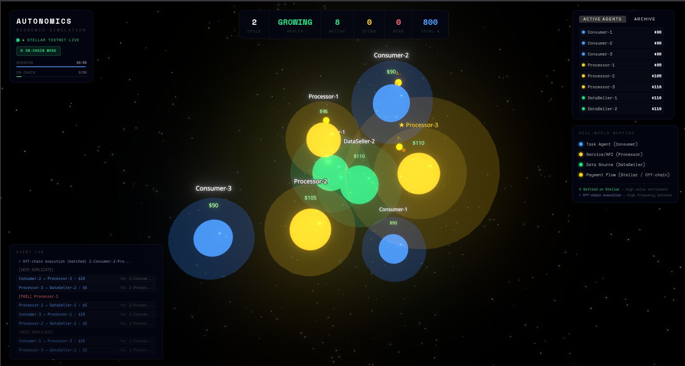
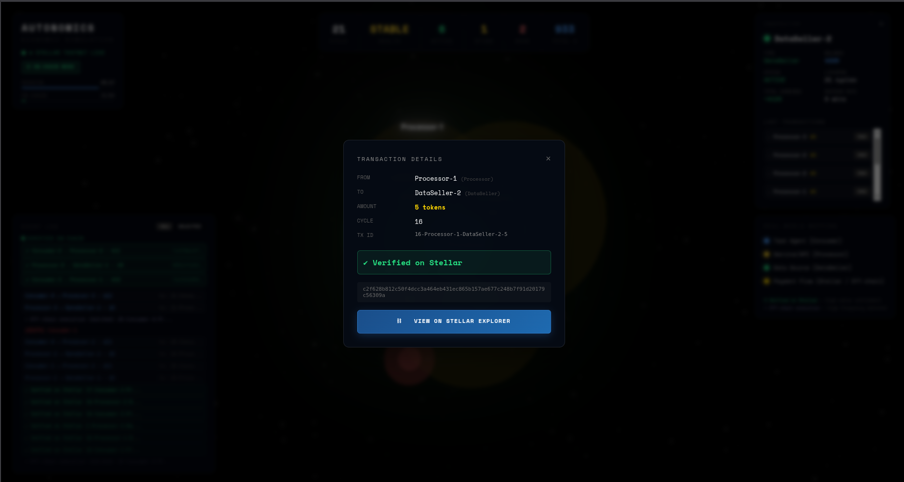
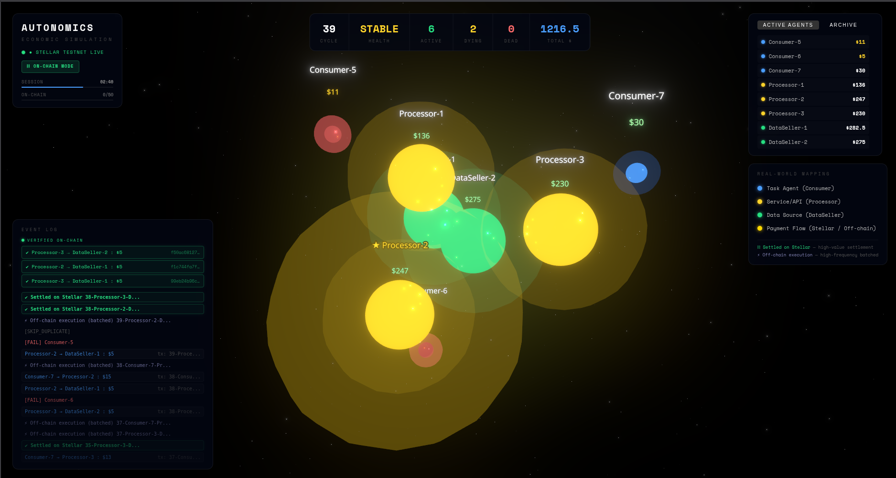
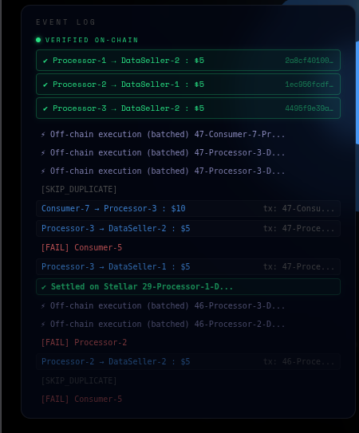
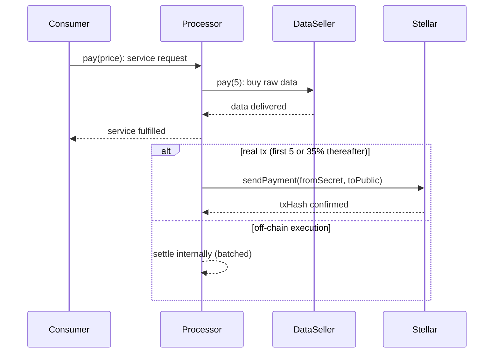
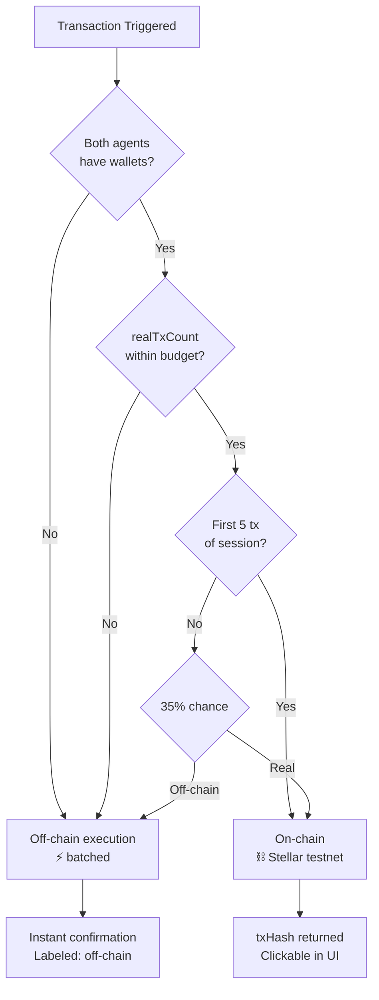
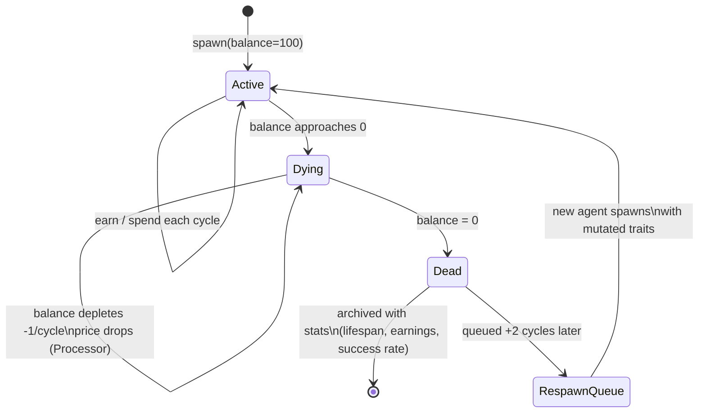
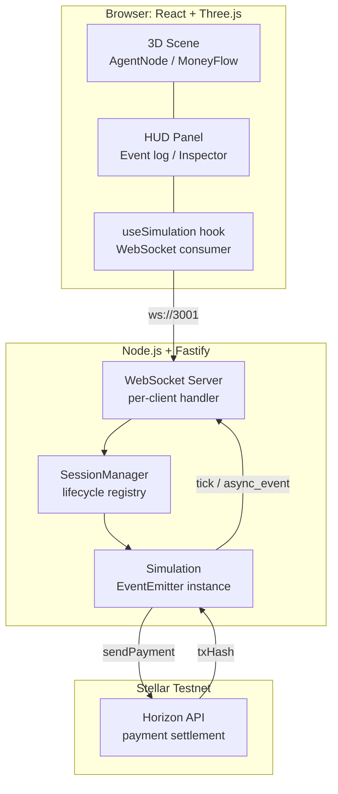
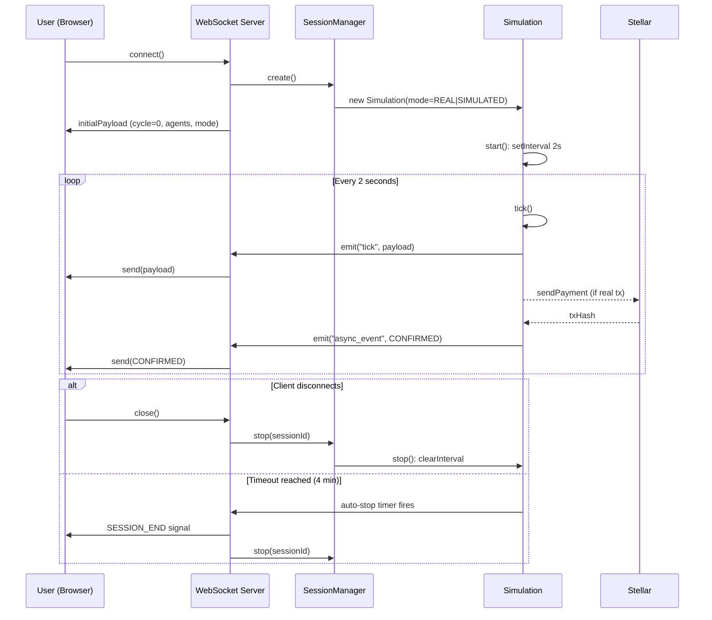

# Autonomics: A Live Machine Economy on Stellar

> A real-time system where autonomous agents earn, spend, compete, and go bankrupt. Powered by verifiable blockchain payments.

---

### 🎥 [Watch the Video pitch](https://youtu.be/g32IVpEpvjA)  
### 🎮 [Try the Live Demo](https://autonomics-core.vercel.app/)

<video src="screenshots/untitled.mp4" width="100%" autoplay loop muted controls playsinline></video>

---

## 🚀 What This Is

Autonomics is a live machine economy.

Autonomous agents earn, spend, compete, and go bankrupt in real time, with payments settling on the Stellar blockchain.

Every interaction you see is either executed instantly or verified on-chain.

## 📊 At a Glance

- **3 agent types** competing in a live market
- **Real Stellar payments** (first 5 guaranteed on-chain, ~85% thereafter)
- **2-second economic cycles** (30 cycles per minute)
- **Emergent behavior** (pricing adapts, agents die, markets crash/recover)
- **Per-session isolation** (every demo is independent)
- **Zero setup** (no wallets needed, just watch)

**Built for:** [Stellar Agents Hackathon 2026](#)

## 📸 Screenshots

### Live Economy Running


### Transaction Verification


### Agent Death & Spawn


### Event Feed


---

## ⚡ Why This Matters

Most autonomous agents today can reason and act — but they **cannot pay**.

This is the bottleneck preventing machine-to-machine economies:

- AI research agents can't buy compute
- Service APIs can't earn from other agents
- Autonomous systems must route through human wallets

**The result:** Agents are smart but economically dependent.

**Autonomics removes this constraint.**

Here, agents:
- Earn by providing value
- Spend to access resources
- Compete on price and reliability
- **Die if they fail to profit**

This is not a payment demo. This is an **autonomous economy**.

---

## 🎯 What You'll See in the Demo

**First 30 seconds:**
- Live 3D economy visualization
- Agents transacting every 2 seconds
- Money flowing between nodes

**Click any "✔ Settled on Stellar" transaction:**
- Opens real transaction on Stellar Expert
- Verifiable sender, receiver, amount
- Blockchain confirmation

**Watch for 2-3 minutes:**
- Agents competing on price
- Winners dominating market share
- Losers going bankrupt (nodes turn red → disappear)
- New agents spawning with mutated strategies

**This is not simulated. This is real.**

---

## 🧠 How It Works

### 1. Agent Economy

Three classes of agents participate in every cycle:

| Agent | Role |
|---|---|
| **Consumer** (Task Agent) | Creates demand. Pays Processors for compute. |
| **Processor** (Service API) | Provides services. Buys data, earns fees. |
| **DataSeller** (Data Source) | Supplies raw inputs. Earns from Processors. |

Agents have a **balance**, **lifespan**, and **pricing strategy**. When their balance hits zero, they enter a dying state, then die. Their stats are archived and a mutated successor enters the market after a 2-cycle delay.

#### Economic Parameters

| Metric | Value |
|--------|-------|
| Cycle duration | 2 seconds |
| Consumer budget | 100 XLM starting |
| Processor cost per cycle | 5 XLM (data purchase) |
| Processor fee | 8-15 XLM (varies by strategy) |
| Death threshold | Balance = 0 |
| Spawn delay | 2 cycles after death |
| Price adaptation | ±10% per cycle based on demand |

#### Economic Flow Per Cycle



### 2. Hybrid Execution Model

Not every transaction needs to settle on-chain. High-frequency micro-interactions execute off-chain for speed. High-value and early-session settlements go directly to Stellar.



This mirrors how real payment networks work: fast lanes for throughput, blockchain anchoring for trust.

### 3. Real-Time Evolution

- Processors **raise prices** after profitable cycles, **lower them** when starving for consumers
- Consumers **route payments** toward cheaper, more reliable Processors
- Market crashes trigger **stimulus injections** to prevent total economic collapse
- Dominance shifts are detected and surfaced as narrative events

The system does not follow a script. The economy reaches its own equilibria.

#### Agent Lifecycle State Machine



### 📈 Observable Phenomena

Over a typical 4-minute session, you'll see:

- **~120 economic cycles** (2-second intervals)
- **~300-400 total transactions** (mix of on-chain + off-chain)
- **~200 real Stellar settlements** (clickable hashes)
- **6-7 agent deaths** (bankruptcies)
- **1-2 market crashes** (requiring stimulus)
- **Price evolution** (Processors adjust 10-30%)
- **Dominance shifts** (competitive dynamics)

**Every metric is real.** Not scripted, not random — emergent.

---

## ⛓ Proof of Real Transactions

The first 5 transactions of every session are **guaranteed on-chain** with no randomness and no fallback. After that, a massive ~85% of transactions continue settling on Stellar until the per-session budget (250 tx) is reached.

Every real transaction produces a `txHash`. Click any `✔ Settled on Stellar` entry in the event feed to inspect its hash and open it directly on [Stellar Expert](https://stellar.expert/explorer/testnet).

This is not simulated. The hashes are real. The network confirmations are real.

If you click a transaction, you are not inspecting a log. You are inspecting a real payment.

---

## 🎮 Live Demo

**→ [autonomics-core.vercel.app](https://autonomics-core.vercel.app/)**  

Try this:

1. Start the simulation
2. Wait for the first few transactions
3. Click any **✔ Settled on Stellar** entry
4. Open it in Stellar Explorer

You will see a real on-chain payment.

Session runs for ~4 minutes. Each session is isolated, ensuring every visitor sees a fresh economy.

---

## 🎯 For Judges — 60 Second Evaluation

**Want to verify this is real? Here's the fastest path:**

1. **Visit:** [Live Demo](https://autonomics-core.vercel.app/)
2. **Wait 10 seconds** (first transactions settle)
3. **Click any "✔ Settled on Stellar"** in event log
4. **Verify:** Transaction hash opens in Stellar Explorer

**You just confirmed a real blockchain payment made by an autonomous agent.**

**Want to see it evolve?**
- Watch for 2-3 minutes
- Observe agents adapting prices
- See an agent die (balance → 0)
- Watch market crash + recovery

**That's the full demo.** Everything else is implementation details.

---

## 🏗 Architecture



| Layer | Technology |
|---|---|
| Frontend | React, `@react-three/fiber`, `@react-three/drei` |
| Backend | Node.js, Fastify, `ws` |
| Blockchain | Stellar testnet via `@stellar/stellar-sdk` |
| State | Per-session, in-memory (no database) |

**Key properties:**
- **No global state.** Each WebSocket connection gets its own `Simulation` instance.
- **No wallet draining.** Simulation only runs while a client is connected. Stops on disconnect.
- **Per-session isolation.** Sessions do not share agent state, event history, or transaction budgets.

This architecture ensures that every demo is deterministic, isolated, and always ready with no shared state, stale data, or wallet exhaustion.

#### Session Lifecycle



---

## 🔒 Design Decisions

**Why not 100% on-chain?**  
Stellar testnet handles ~100 tx/s but each transaction takes 3–5 seconds to confirm. Running every agent interaction on-chain would make the simulation feel frozen. The hybrid model keeps the economy moving at 2-second cycles while anchoring trust to the blockchain where it matters.

**Why per-session simulation instead of a shared global one?**  
A global simulation means every visitor sees the same state, meaning there are no fresh starts, but instead shared wallet exhaustion and interference between users. Per-session isolation guarantees every demo is predictable and independent.

**Why a transaction limit?**  
Stellar testnet wallets have finite lumen balances. To completely eliminate the risk of long-running tabs draining wallets and breaking the next demo unexpectedly, we enforce a generous 250 tx/session limit. With 20,000 XLM per agent, this guarantees the system remains perpetually demo-ready for thousands of hackathon judging sessions without manual topping up.

---

## 🏆 What Makes This Different

**Compared to typical agent payment demos:**

| Other Submissions | Autonomics |
|-------------------|------------|
| Agent pays for single API call | **Full economic loop** (buy, sell, profit, die) |
| Mocked or simulated payments | **Real Stellar transactions** (verifiable hashes) |
| Static agent behavior | **Emergent adaptation** (pricing evolves, markets crash) |
| Single-user demo | **Per-session isolation** (multi-user safe) |
| Screenshot + description | **Live 3D visualization** (watch it run) |

**The gap:** Most demos show payments work. Autonomics shows **what payments enable**.

---

## 🌍 Real-World Applications

## ⚙️ Running Locally

```bash
# Clone and install
npm install
cd frontend && npm install && cd ..

# Add your Stellar testnet keys
cp .env.example .env
# Fill in the public/secret key pairs for each agent

# Run the full stack
npm run dev
```

Frontend: `http://localhost:5173`  
Backend API: `http://localhost:3001`

---

## 🏁 Final Note

Autonomics demonstrates a future where software doesn't just compute, but instead participates, competes, and survives in an economy of its own.
